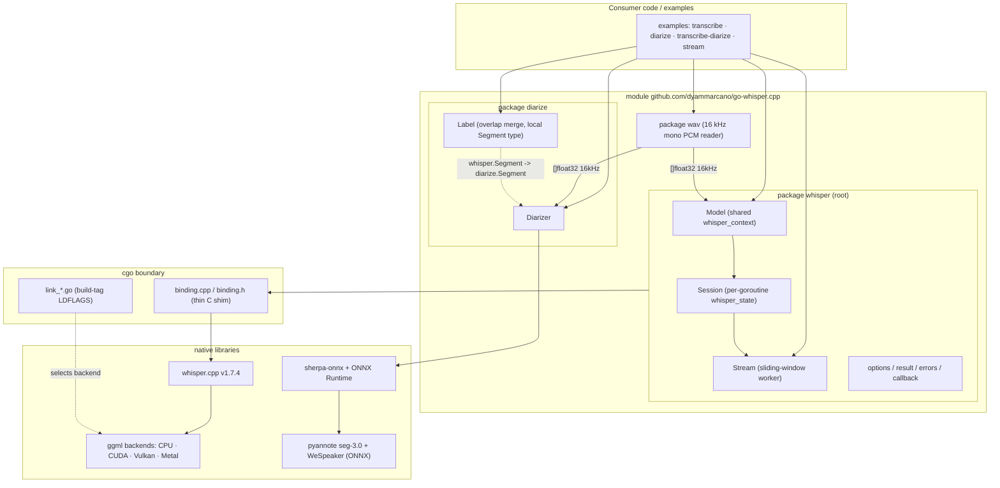
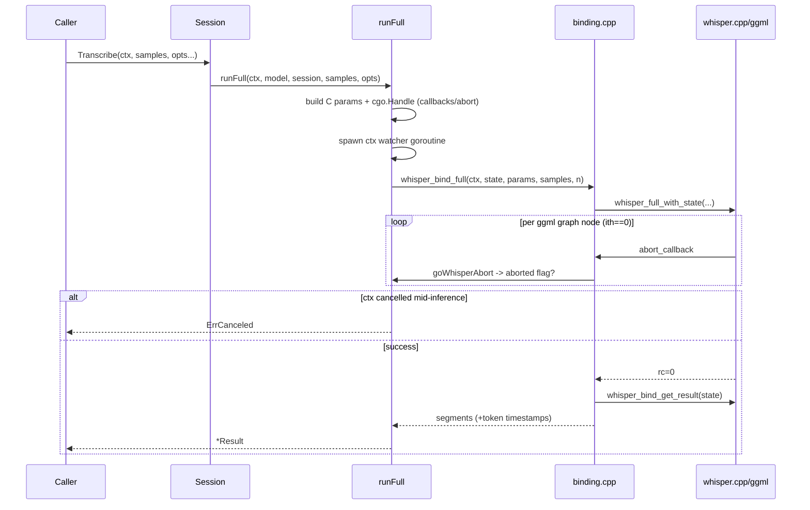
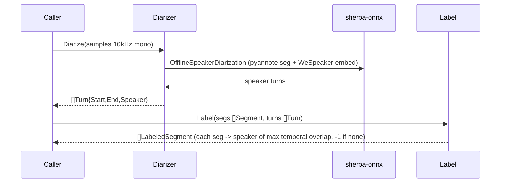
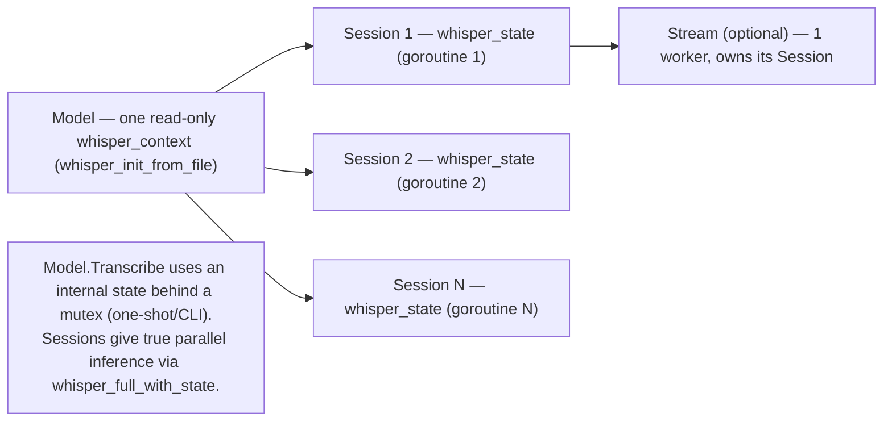

# Architecture

`go-whisper.cpp` is a cgo binding over [whisper.cpp](https://github.com/ggml-org/whisper.cpp)
plus an independent sherpa-onnx diarization package. Diagrams below reflect the actual code.

## System overview



The `diarize` package never imports `whisper`; callers map `whisper.Segment` →
`diarize.Segment` in two lines, keeping transcription and diarization independently linkable.

## Transcription flow (sequence)



## Streaming flow (sequence)

```mermaid
sequenceDiagram
    participant P as Producer goroutine
    participant B as streamBuffer
    participant Wk as Stream worker
    participant S as Session
    participant Cons as Consumer

    P->>B: Write(chunk)  %% blocks (backpressure) or drops oldest
    P->>B: CloseSend()   %% after last chunk
    loop every step of new audio (or buffer >= window)
        Wk->>B: nextWindow(since, step, window)
        B-->>Wk: trailing window + windowStart + consumed
        Wk->>S: Transcribe(window, initial_prompt=committed text)
        S-->>Wk: segments
        Wk->>Wk: classifyWindow -> finals (once) + partials
        Wk->>B: slide(committed - keep)
        Wk-->>Cons: StreamResult{Partial|final}
    end
    Note over Wk: defer st.cancel() on exit -> stops buffer ctx goroutine (no leak)
    Wk-->>Cons: close(Results); Err() valid
```

## Diarization + merge flow (sequence)



## Concurrency model



## Build-tag backend selection

CPU is the default. GPU backends are opt-in via build tags, each with its own link file:

| Build tag | File | Backend | Linkage |
|-----------|------|---------|---------|
| _(none)_ `windows` | `link_static_windows.go` | CPU static | `whisper.cpp/build-cpu/*.a`, `-fopenmp` off on MinGW |
| `cuda` | `link_cuda_windows.go` | CUDA | `build-cuda/bin/whisper.dll` (MSVC) |
| `vulkan` | `link_vulkan_windows.go` | Vulkan | `build-vulkan/*.a` + `vulkan-1.dll` |
| `linux` | `link_linux.go` | CPU static | `build-cpu/*.a` |
| `darwin` | `link_darwin.go` | Metal/Accelerate | `build-cpu/*.a` + frameworks |

See [ADR-0001](adr/0001-cgo-binding-over-whisper-cpp.md) for the binding strategy,
[ADR-0002](adr/0002-native-diarization-sherpa-onnx.md) for diarization, and
[ADR-0003](adr/0003-streaming-sliding-window.md) for streaming.
